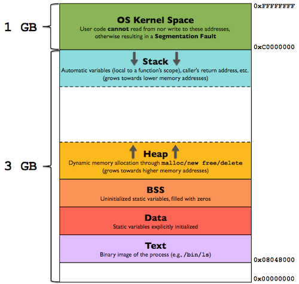

% CSE30 Discussion 7
% Ibrahim Awwal
% July 20, 2015

# ARM Assembly

## Conditional Execution

- `CMP` instruction: compares register(s) and/or immediates
- equivalent to `SUBS` without storing result of subtraction
- Why is this?
- After performing comparison, we can conditionally execute any instruction

## Conditional Execution - Examples

## Control Flow - if

## Control Flow - for

## Function Calls

## The Stack

- In general, a stack is a Last In, First Out data structure (LIFO)
- Basic operations: *push* data onto stack, *pop* data off of stack
- In terms of computer organization, *the stack* is a region of memory that operates in this manner
- Stores automatic variables, return address, any registers we need to save before calling a function

## Memory Layout

## Stack Nomenclature

- **Ascending** stack grows upwards, i.e. memory addresses go from low to high
- **Descending** stack grows downwards, i.e. memory addresses go from high to low
- **Empty** stack, the stack pointer points to the next free (empty) location on the stack
- **Full** stack, the stack pointer points to the topmost item in the stack

. . .

- The ARM Linux stack convention is to use a **full descending** stack
- That is, addresses grow downwards, and `$sp` points to the last item pushed onto the stack

## Push and Pop Instructions

- Push registers onto, and pop registers off a full descending stack.
- PUSH{cond} reglist
- POP{cond} reglist
- reglist is a non-empty list of registers, enclosed in braces. It can contain register ranges. It must be comma separated if it contains more than one register or register range.
- PUSH and POP are synonyms for STMDB and LDM (or LDMIA), with the base register sp (r13), and the adjusted address written back to the base register
- [source](http://infocenter.arm.com/help/index.jsp?topic=/com.arm.doc.dui0204j/Babefbce.html)

## System Calls: Leveraging the OS

- You can think of it as calling functions which are part of the OS
- Has a different calling convention from normal functions
- Each system call has a number associated with it
- Store parameters in `r0`-`r6`, system call number in `r7`
- Call syscall using `SVC` instruction
- Examples: `write` writes to a file descriptor, `sbrk` is for allocating more heap space

## System Calls: References

- Syscall numbers: `/usr/include/arm-linux-gnueabihf/asm/unistd.h`
- [Linux Syscalls (incl. arguments)](http://lxr.free-electrons.com/source/include/linux/syscalls.h)
- Manpages are accessible under section 2 (eg. `man 2 write`)
- [More info](http://thinkingeek.com/2014/05/24/arm-assembler-raspberry-pi-chapter-19/)

# Exercises

## int to hex string

~~~~{.c}
char *itohex(int x);
~~~~

- Returns hex representation of integer x as a string
- eg. `itohex(256)` --> `0x00000100`

## Linked Lists

~~~~{.c}
\include{src/ll.h}
~~~~

## Binary Tree

~~~~{.c}
\include{src/tree.h}
~~~~
